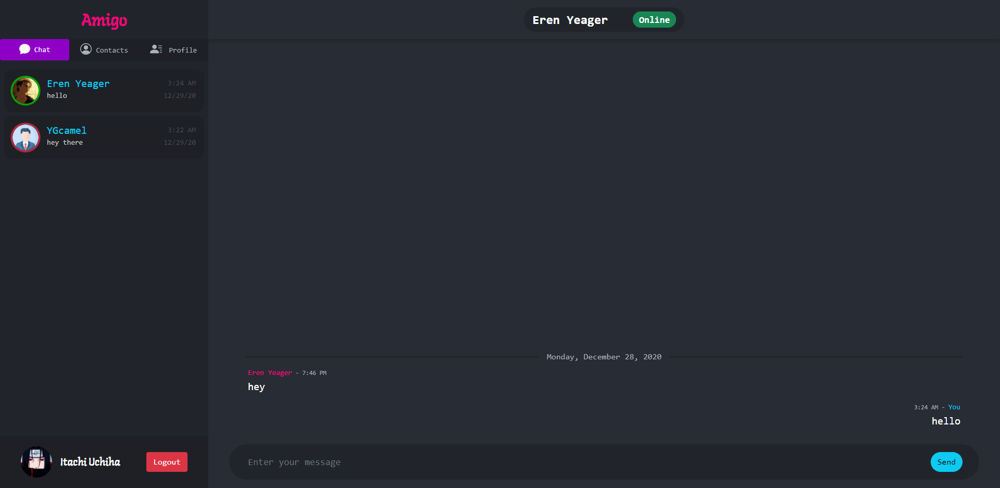
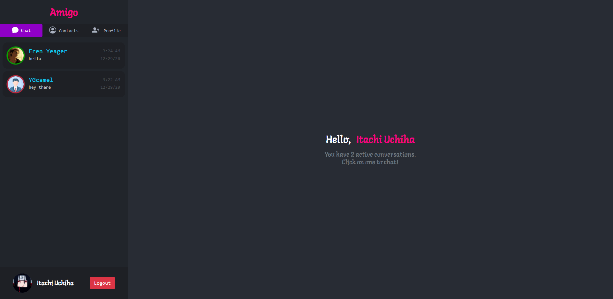
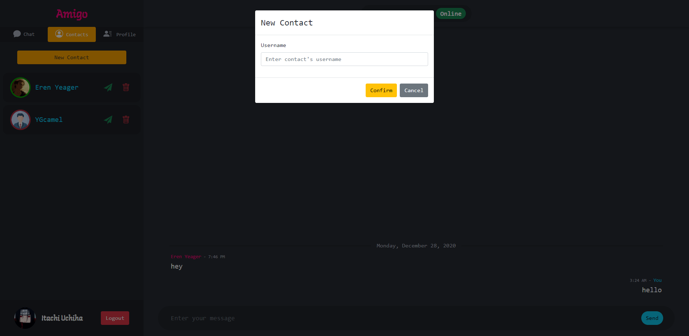
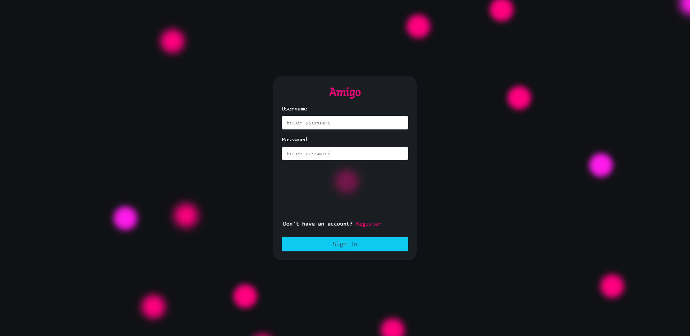

# Amigo

A real-time chat application developed with the MERN stack.

Live Version: https://amigo-chat.herokuapp.com/

## Description

This app allows users to chat with other users in real-time. Users need to create an account with a unique username and password. Users can add contacts and see who's online. User can also set a custom profile picture.

**Key features**
- [x] Chat with others
- [x] User authentication.
- [x] Online status
- [x] Add contacts
- [ ] Responsive

## Development

I developed the client using React. Used React Router and functional components. Primarily used SASS and Bootstrap to style everything. Used a lot of redux for state management. Used Socket.io for real-time features. Used Axios to make API requests.

Developed REST API using Node and Express. Used MongoDB Atlas for database.

## Screenshots
##### Conversation

##### Home

##### Adding contact

##### Login

### Asset Credits

Default Profile Icon made by <a href="https://www.flaticon.com/authors/freepik" title="Freepik">Freepik</a> from <a href="https://www.flaticon.com/" title="Flaticon"> www.flaticon.com</a>